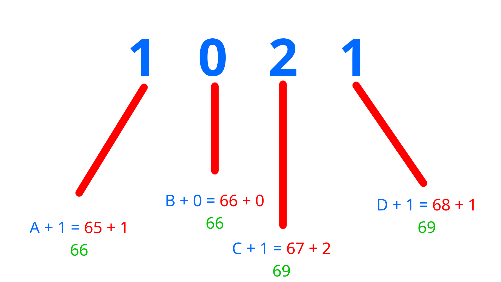

# CASCI - Characterised Alternate Secure Calendar Integrals
A Secure encryption Algorithm which allows you to hardly encrypt and decrypt your files in a safer way, By using a unique machenism Known as "Calendar Integral Pushing", Which is this.

## CASCI - Calendar Integral Pushing Algorithm


Here You can see that the output with `Calendar Integral Pushing Algorithm` was,

 - ABCD = 66 66 69 69
 - Which translates into BBEE
 - Because a Standard Pattern of Integers was applied to the string "ABCD" with `Calendar Integral Pushing Algorithm` so according to the pattern (1021) A was 65 and then became an equation `A + 1 = 65 + 1`, By Solving the equation we get `A + 1 = 66` which is translated into `B` and then , B was 0 so it formed `B + 0 = 66 + 0` by solving we get `B + 0 = 66` which translated into `B` and same as this we seperated the `Integers` into `Integrals` which will be looped over and added in encryption and decrypt will decrypt it by subtracting the `Integrals`. When we groups a lot of `Integrals` then it forms a `pattern` and without pattern is becomes impossible to crack the encryption caused by `Calendar Integral Pushing Algorithm`.

 - `Calendar Integral Pushing Algorithm` was designed and developed by **Tanishq Pal** an Indian Computer Hobbyist also commonly known as **ghgltggamer** in Social Media Platforms like youtube.


## What are Integrals?
An `Intergrals` are the collection of so many `Integral` values ie `1`, `2`, `3`, `4` ... Where these are collected together to form `Integrals` , An `Integral` is a normal numeric value which can is ready to be broken and get looped like `1234` is an Integer and numeric value and you can't loop over `1234` one by one, But in `CASCI`, The numeric values which can be looped over are known as `Integral`/`Integrals`, They are commonly seen as `1 2 3 4` not `1234`.

## What is a pattern?
A `Pattern` is a unique and structured `Integrals` value, Which can be used to encrypt something with CASCI. like `1 2 3 4`, And later be used to decrypt correctly. However wrong pattern won't allow perfect or exact decryption. Also the pattern can't be an string!

## What is CASCI?
`CASCI` stands for `Characterised Alternate Secure Calendar Integrals` which is a full fledged format and machenism based on `Calendar Integral Pushing Algorithm` in order to perform both encryption and deceyption of a data & information in a secure and Characterised way.

`CASCI` needs a pattern to do both encryption and decryption with a lot of robustness, Also `CASCI` don't provides any help, If you forgot the password then your data is completly lost now, And can't be reversed engineered without the `pattern`.

**Precautions**
 - Pattern Length Is The Strength of your encryption, How long your pattern will be under `std::size_t` that much the stronger the `CASCI Encryption` will be.
 - If you forgot the pattern , You can't reverse engineer it.
 - Patterns Can be broken , Simple patterns can be broken with traditional techniques, Try stronger patterns.

## Implementation of CASCI - Characterised Alternate Secure Calendar Integrals
The Orignal version and very first version of CASCI was written in `C++` with some `C` features by `Tanishq Pal` (ghgltggamer) as a Library, In order to convert any type of complex data into a valid `CASCI` Encoding / Encryption, And Decode / Decrypt it. 

**This is the official Repository for CASCI**

### Installing the CASCI Library
For installing the CASCI Library Use the following commands. (Make sure that you have `git` already been installed)
```bash
git clone https://github.com/darkyboys/casci.git
mv casci/src/casci.hh .
rm -rf casci/*
mv casci.hh casci
echo "Casci is installed, And is ready to be included with <casci/casci.hh>."
echo ""
```

**Now include the casci library from `casci/casci.hh`**

#### Learning The CASCI Library!
The `CASCI` Library does all the heavy lifting for you, To allow you to write code with `CASCI`. It's very simple C++ Library for anyone to use `CASCI`.

**Basics**
`CASCI` Library provides you a class which is having 2 Different functions `encrypt/decrypt` in order to perform encoding/encryption and decoding/decryption. You will be always using this class and these functions to perform stuff operations you want.

**CASCI - Class**
This is the class allows you to access the `encrypt/decrypt` methods of the class in order to perform encoding/encryption and decoding/decryption with a lot of ease, All you need is the include the `casci/casci.hh` and create an inheritance of the class with the string data you want to operate in order to start operating.

```cpp
#include <iostream>
#include "casci/casci.hh"

int main (){

    CASCI myCasci("The Data on which the operations will be performed.");

}
```

You can also do this like this:

```cpp
#include <iostream>
#include "casci/casci.hh"

int main (){

    std::string data = "The Data on which the operations will be performed.";
    CASCI myCasci = data;

}
```

**Go With what you needs**.

--- 

**encrypt - method**
`encrypt` method takes a `std::string` as the pattern and then returns the encrypted/encoded format of the given data as a string.

Example
```cpp
#include <iostream>
#include "casci/casci.hh"

int main (){

    std::string data = "Hello!";
    CASCI myCasci = data;

    std::string pattern = "21834831"; // A Strong Pattern
    std::cout <<myCasci.encrypt(pattern)<<'\n';

}
```

Output
```txt
74 102 116 111 115 41
```

---


**decrypt - method**
`decrypt` method takes a `std::string` as the pattern and then returns the decrypted/decoded format of the given encrypted/encoded data as a string.

Example
```cpp
#include <iostream>
#include "casci/casci.hh"

int main (){

    std::string data = "74 102 116 111 115 41 "; // Encoded/Encrypted String
    CASCI myCasci = data;

    std::string pattern = "21834831"; // A Strong Pattern
    std::cout <<myCasci.decrypt(pattern)<<'\n';

}
```

Output
```txt
Hello!
```

**Note: A Proper CASCI Encoding/Encryption Contains a [space] in the end of a CASCI encoding.**

---

### Installing the CASCI Binary
`CASCI` Binary is a tool writtin in C++ by `Tanishq Pal` (ghgltggamer) in C++ to allow you to encrypt and decrypt the `CASCI` Files/Format without needed to write programs.

**Installing**
Please run the following commands to install binary and be sure to have the dependencies pre-installed.

**Dependancy**
 - GNU GCC
 - Magma Build System
 - Git

**Install Magma from [Magma's Official Repository](https://github.com/darkyboys/magma)**
Then use the following commands to install binary!
```bash
git clone https://github.com/darkyboys/casci.git
cd casci/
magma
cd ..
echo "Casci Binary is installed at <casci/bin/casci>. Please move it to your environment path for better usage."
echo ""
```

Move to environment path in Linux Systems
```bash
sudo mv casci/bin/casci /usr/local/bin
```

#### Documentation for CASCI Binary!
`CASCI` Binary provides a CLI way to perform encoding/encryption and decoding/decryption for the entire files with the following commands.

You must use the proper format to use CASCI!

**Format**
```bash
casci [option] [file name] [pattern] [optional but the destination to the file]
```

*Note: If you just execute casci, Then it will show youu the version of casci*

**e/encrypt - option**
`e` or the `encrypt` option will encode/encrypt an entire file into the CASCI Format where the calendar will be made as per the given pattern! (Tip: Strong patterns = More Security).

Example
```bash
casci e myfile.txt 1234 '/home/myUser/'
```
*Please Replace the placeholders with the actual data!*

The given command is aiming to encrypt/encode a file into CASCI Format on pattern 1234, This will output a casci file which will be `myfile.txt.casci`.

**d/decrypt - option**
`d` or the `decrypt` option will decode/decrypt an entire casci file from the CASCI Format to the raw file by preparing the calendar to be made as per the given pattern! (Tip: Correct patterns = Correct Output).

Example
```bash
casci d myfile.txt.casci 1234 '/home/myUser/'
```
*Please Replace the placeholders with the actual data!*

The given command is aiming to decrypt/decode a casci file into from the CASCI Format to the raw format on pattern 1234, This will output the raw file which will be `myfile.txt`.

**Note: the output by decrypt will be as per the pattern , If patter is correct then the output will be also correct othervise the output will be trash.**

---

## Want To Contribute ?
`CASCI` Project is under the `MIT License` which is why you can feel free to CONTRIBUTE!
Just make sure to checkout the [LICENSE TERMS](LICENSE) and [Contribution Guidelines](CONTRIBUTING.md).

## Thanks for READING and Giving your important time to this!

Copyright (c) ghgltggamer 2025
